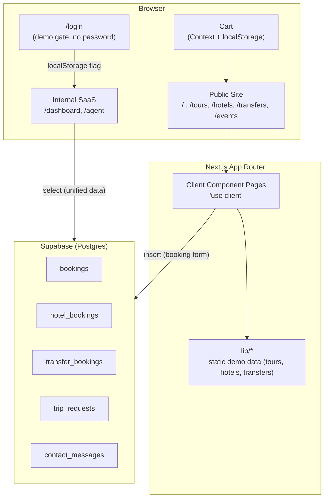

# Voyara Travel — Portfolio Case Study

A sanitized portfolio demo of a digital tour-operator platform: a public marketing site plus an internal SaaS (admin dashboard + agent portal) sharing the same backend. "Voyara Travel" is a fictional demo brand — see [`CASE-STUDY-NOTES.md`](CASE-STUDY-NOTES.md) for full details on scope, sanitization and setup.

## Tech Stack

| Layer | Technology |
|---|---|
| Framework | [Next.js 16](https://nextjs.org) (App Router, Turbopack) |
| UI | [React 19](https://react.dev) + [TypeScript](https://www.typescriptlang.org) |
| Styling | [Tailwind CSS v4](https://tailwindcss.com) + CSS Modules (dashboard/agent) |
| Backend | [Supabase](https://supabase.com) (Postgres, Row Level Security, REST via `supabase-js`) |
| Images | `next/image` with automatic optimization |
| Payments | `stripe` (dependency present, test keys only) |

## Architecture



## Project Structure

```
app/
├── page.tsx              → home (alias of /vetrina)
├── vetrina/               → public site (hero, search, destinations)
├── tours/                 → excursion catalog + detail + booking
├── hotels/                → hotel catalog + detail + booking
├── transfers/              → airport transfer + booking
├── contact/                → contact page + map + FAQ
├── events/                 → events + review gallery + partners
├── make-your-trip/         → custom booking wizard (3 steps)
├── cart/                   → shopping cart
├── login/                  → CRM access gate (demo, no password)
├── dashboard/              → Admin Dashboard (internal SaaS)
├── agent/                  → Agent Portal (internal SaaS)
└── brand/photo-sign/       → printable sign for excursion photos
lib/
├── tours.ts, hotels.ts, transfers.ts   → catalog demo data
├── destinations.ts, tour-themes.ts     → tour filter taxonomies
├── events.ts, reviews.ts               → demo events and review data
├── cart-context.tsx                    → global cart state
├── useCrmAccess.ts                     → internal SaaS access-gate hook
└── supabase.ts                         → Supabase client
supabase/
└── schema.sql              → table definitions + RLS policies
```

## Languages

Public site: **EN, AR, IT, RU, DE** (language switcher on every page, automatic RTL for Arabic).
Internal SaaS (dashboard/agent): **EN, AR**.

## Database (Supabase)

Main tables, all with Row Level Security enabled:

| Table | Purpose | Public insert | Public read |
|---|---|---|---|
| `bookings` | Tour bookings | ✅ | ✅ (dashboard demo, no auth) |
| `hotel_bookings` | Hotel bookings | ✅ | ✅ |
| `transfer_bookings` | Transfer bookings | ✅ | ✅ |
| `trip_requests` | "Make Your Trip" requests | ✅ | — |
| `contact_messages` | Contact form messages | ✅ | — |
| `package_bookings` | Historical package bookings | — | ✅ |

⚠️ **Security note**: public read access on `bookings`/`hotel_bookings`/`transfer_bookings`/`package_bookings` exists only so the internal dashboard demo works without real authentication. The `/login` page is a client-side gate (localStorage), **not** real authentication — anyone can bypass it from the browser console. This is intentional for a portfolio demo; a production deployment would need real authentication (Supabase Auth) with RLS policies restricted to admin/agent roles.

## Local Setup

```bash
npm install
```

Copy `.env.example` to `.env.local` and fill in your own demo credentials (Supabase project, Stripe test keys, site access password). No real credentials are included in this repository — see `CASE-STUDY-NOTES.md` for the full list of environment variables.

Run `supabase/schema.sql` in the SQL editor of your own Supabase project to create the tables.

```bash
npm run dev
```

Open [http://localhost:3000](http://localhost:3000).

## About This Project

This repository is a sanitized portfolio case study — see [`CASE-STUDY-NOTES.md`](CASE-STUDY-NOTES.md) for purpose, architecture, sanitization notes, and remaining setup TODOs.
